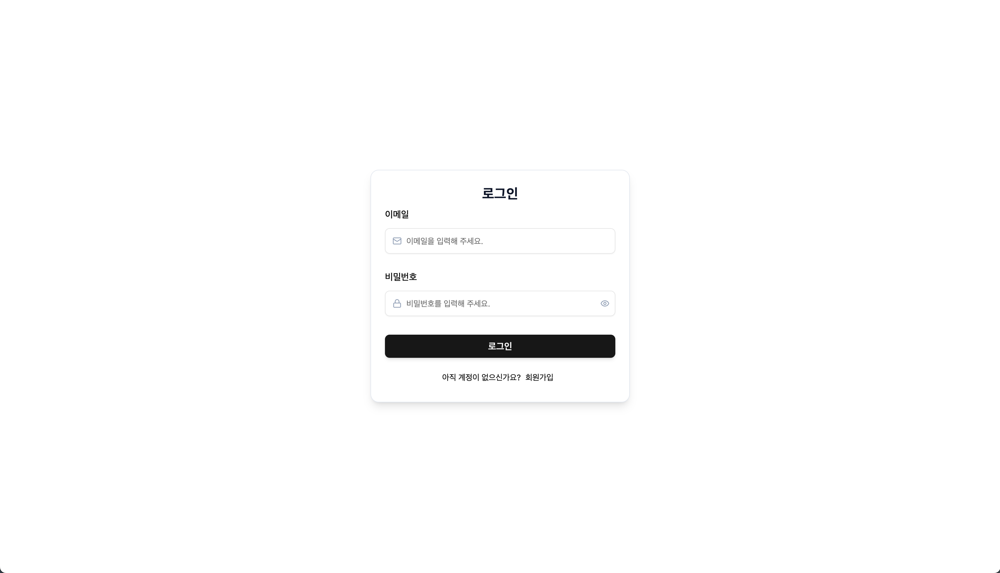

# 🎓 LearnoteAI

> **AI 시니어가 정제하는 나만의 학습 아카이브**

<div align="center">


[]()
[](#-tech-stack)
[](LICENSE)

<br />

"생각나는 대로 쓴 노트가 당신의 커리어가 되도록"  
단순한 메모를 넘어, AI가 당신의 지식을 검증하고 학습 방향을 제시합니다.

</div>

---

## 🔗 Quick Links

- **🌐 Live Demo:** [배포 링크]()
- **🖥️ Frontend Repository:** [learnote-ai-fe](https://github.com/bhy304/learnote-ai-fe)
- **⚙️ Backend Repository:** [learnoteAI-BE](https://github.com/JHParrrk/learnoteAI-BE)

---

## 🖥️ Preview (Screenshots)

<div align="center">
  
</div>

---

## 📑 목차 (Table of Contents)

- [🏗️ 프로젝트 개요](#-프로젝트-개요)
- [✨ 핵심 기능](#-핵심-기능)
- [🛠️ 기술 스택](#-기술-스택)
- [📂 프로젝트 구조](#-프로젝트-구조)
- [⚙️ 시작하기](#-시작하기)
- [📄 라이선스](#-라이선스)

---

## 🏗️ 프로젝트 개요 (Project Overview)

**LearnoteAI**는 지능형 학습 지원 플랫폼으로, 사용자가 작성한 학습 내용을 AI 전문 시니어의 관점에서 분석하고 정제합니다.

### 🎯 주요 목표

- **지식의 정교화**: AI 분석을 통해 학습 내용의 오류를 바로잡고 정확한 지식을 습득하도록 돕습니다.
- **학습의 가이드**: 작성된 내용을 바탕으로 연관된 심화 지식을 제안하여 학습 범위를 넓힙니다.
- **커리어 자산화**: 파편화된 메모를 Markdown 기반의 구조화된 문서로 변환하여 개인의 가치 있는 자산으로 만듭니다.

---

## ✨ 핵심 기능 (Key Features)

### 🧠 1. 지능형 AI 분석 워크플로우

- **실시간 폴링 (Real-time Polling)**: AI 분석 상태를 실시간으로 추적하여 완료 즉시 정보를 업데이트합니다.
- **팩트 체크 (Fact-Check)**: 학습 노트의 사실 관계를 검증하고, 오류 시 정정 제안 및 근거를 제시합니다.
- **전문가 가이드 (Expert Guide)**: 주제에 특화된 심화 학습 가이드를 통해 지식의 깊이를 더합니다.
- **노트 자동 정제 (Refinement)**: AI가 핵심 요약 및 키워드를 추출하고, Markdown 형식으로 문서를 다듬어줍니다.

### 📋 2. 스마트 할 일(Todo) 관리

- **AI 추천 Todo**: 분석 결과를 기반으로 복습이나 추가 학습이 필요한 항목을 자동으로 추천합니다.
- **선택적 저장 로직**: 추천된 항목 중 필요한 것만 선택하여 내 할 일 목록으로 저장할 수 있습니다.
- **중복 생성 방지**: 서버 상태 동기화를 통해 이미 추가된 추천 항목은 중복되지 않도록 처리합니다.

### 📊 3. 대시보드 및 UX

- **활동 히트맵 (Heatmap)**: 깃허브 스타일의 잔디 위젯으로 나의 학습 꾸준함을 시각화합니다.
- **칸반 보드 (Kanban)**: 드래그 앤 드롭 방식을 통해 학습 진행도를 직관적으로 관리합니다.
- **낙관적 UI (Optimistic UI)**: 상태 변경 시 즉각적으로 UI를 반영하여 높은 반응성을 제공합니다.

---

## 🛠️ 기술 스택 (Tech Stack)

### 💻 Frontend

| 분류           | 기술 스택                                                |
| :------------- | :------------------------------------------------------- |
| **Framework**  | `React 19`, `TypeScript`, `Vite 7`                       |
| **Styling**    | `Tailwind CSS v4`, `Shadcn/ui`, `Lucide React`           |
| **State**      | `Zustand` (Global), `TanStack Query v5` (Server)         |
| **Network**    | `Axios` (JWT Refresh Queueing), `Orval` (API Client Gen) |
| **Validation** | `React Hook Form`, `Zod`                                 |

### ⚙️ Backend & Infrastructure

- **Framework:** NestJS (Node.js)
- **Deployment:** Vercel (Frontend), Fly.io (Backend)

---

## 📂 프로젝트 구조 (Project Structure)

```text
src/
├── api/          # Axios 설정, 인터셉터 및 서버 연동 코드 (generated)
├── components/   # 도메인별 컴포넌트 (Dashboard, Kanban, Common UI, Table)
├── hooks/        # 실시간 폴링, 노트 액션, 폼 핸들링 커스텀 훅
├── models/       # 백엔드 스펙과 동기화된 TypeScript 인터페이스
├── pages/        # 도메인별 페이지 (Dashboard, NoteDetail, CreateNote, Auth)
├── store/        # Zustand 기반 인증 및 글로벌 상태
├── schema/       # Zod 기반 유효성 검사 정의
└── lib/          # API 주소 설정, 포맷팅 등 유틸리티
```

---

## ⚙️ 시작하기 (Getting Started)

### 1. 환경 변수 설정

프로젝트 루트에 `.env` 파일을 생성합니다.

```bash
VITE_API_BASE_URL=https://learnoteai-be.fly.dev
```

### 2. 설치 및 실행

```bash
# 의존성 설치
npm install

# 개발 서버 실행
npm run dev

# API 동기화 (Swagger 기준 코드 생성)
npm run g:api
```

---

## 📄 라이선스 (License)

본 프로젝트는 **MIT License**를 따릅니다.

---

<div align="center">
  <p>Copyright © 2026 LearnoteAI Team. All rights reserved.</p>
</div>
